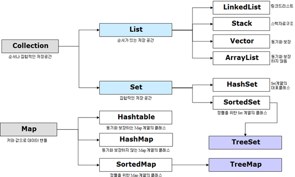
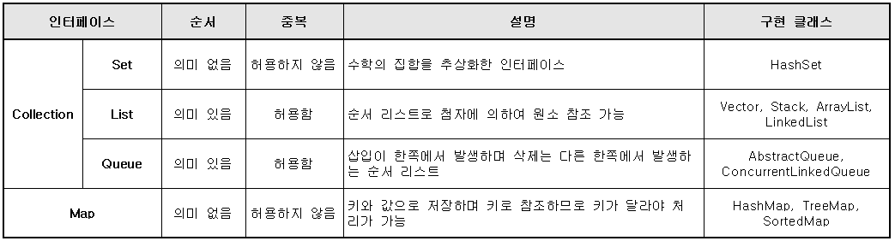
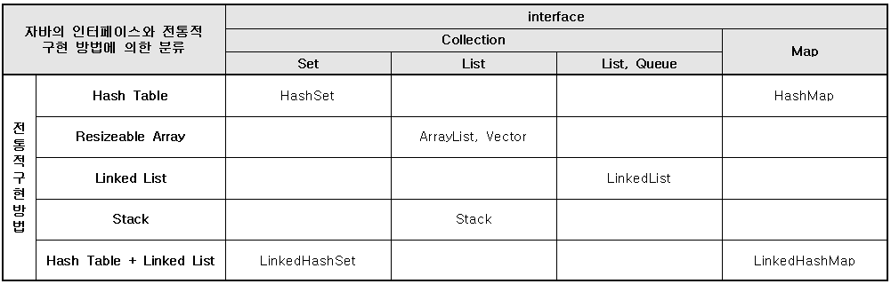

# JCF(Java Collection FrameWork)과 Genertic에 관한 탐구

## 1. Collection Framework  
**Collection Framework는 여러 객체 원소의 삽입과 삭제가 편리한 자료 구조를 지원하는 인터페이스와 클래스의 모임**이다. 
자바는 인터페이스 Collection, Set, List, Queue, Map과 이를 구현한 여러 클래스로 Collection Framework를 구성한다. 
JCF를 구성하는 여러 인터페이스는 여러 원소의 삽, 삭제, 관련 연산을 처리해야 하는 메소드를 추상으로 제공한다. 

  

**자바의 컬렉션은 크게 인터페이스 Collection과 Map으로 구분**된다. 
인터페이스 Collection은 다시 인터페이스 Set과 List 그리고 Queue로 분류된다. 
인터페이스 Set은 수학에서 배운 집합을 표현한 인터페이스이다. 
인터페이스 Set, List, Queue는 객체 하나를 컬렉션의 원소로 처리하나, 인터페이스 Map은 이와 다르게 key와 value의 쌍으로 구성된 자료구조를 컬렉션의 원소로 처리한다. 
다음은 4가지 인터페이스의 주요 특징을 정리한 표이다.  

  

**인터페이스 Set와 Map은 원소의 중복을 허용하지 않으나 인터페이스 List와 Queue는 원소의 중복을 허용하며, 순서에 의미**가 있다. 
  자바의 컬렉션 인터페이스를 구현한 클래스는 매우 다양하며 관련 클래스의 이름은 HashMap과 같이 [내부구현방법][인터페이스이름]으로 구성된다. 
즉 HashMap 클래스에서 Hash는 구현 방법을, Map은 인터페이스의 이름을 나타낸다. 다음은 자바 컬렉션 관련 클래스를 분류한 표이다.

  

### 1) List Collection
**인터페이스 List는 순차적으로 나열된 원소를 처리하는 구조로, 첨자를 인자로 하는 메소드를 제공**한다. 
인터페이스 List를 상속받아 구현한 대표적인 클래스로는 LinkedList, ArrayList, Vector, Stack 등이 있다. 
다음은 인터페이스 List의 주요 메소드이다. 

| 메소드                                      	| 설명                                                           	|
|---------------------------------------------	|----------------------------------------------------------------	|
| void add(int index, E element)              	| 첨자 index에 원소 E를 삽입                                     	|
| E get(int index)                            	| 첨자 index인 원소를 반환                                       	|
| int indexOf(Object o)                       	| 원소 o를 찾아 첨자를 반환                                      	|
| E remove(int index)                         	| 첨자 index인 원소를 찾아 삭제하고 반환                         	|
| E set(int index, E element)                 	| 첨자 index에 인자 element 원소로 대체하고 이전 객체를 반환     	|
| list\<E\> subList(int fromIndex, int toIndex) 	| 첨자 fromIndex에서 toIndex까지로 구성되는 새로운 리스트를 반환 	|
| ListIterator\<E\> listIterator()              	| 리스트의 모든 값을 ListIterator로 반환                         	|

**인터페이스 ListIterator는 상위로 Iterator를 상속받는 인터페이스로, 컬렉션을 구성하는 원소 집합에서 순방향과 역방향으로 순차적 처리에 편리**하다. 
다음은 ListIterator의 주요 메소드이다. 

| 메소드                	| 설명                                                              	|
|-----------------------	|-------------------------------------------------------------------	|
| boolean hasNext()     	| 순방향으로 이용 가능한 다음 객체가 있으면 true, 아니면 false 반환 	|
| boolean hasPrevious() 	| 역방향으로 이용 가능한 다음 객체가 있으면 true, 아니면 false 반환 	|
| E previous()          	| 이전 객체를 반환                                                  	|
| int previousIndex()   	| 이전 객체의 첨자를 반환                                           	|
| E next()              	| 다음 객체를 반환                                                  	|
| int nextIndex()       	| 다음 객체의 첨자를 반환                                           	|
| void remove()         	| 마지막으로 반환된 원소를 삭제                                     	|

### 2) Set Collection
**인터페이스 Set은 중복을 허용하지 않는 컬렉션**이다. 
인터페이서 Set은 모두 Collection에서 상속받아 재정의한 메소드로 구성되며, 인터페이스 Set을 구현한 클래스로는 HashSet, TreeSet이 대표적이다. 
특히 클래스 TreeSet은 Set에서 정렬을 지원하는 SortedSet 인터페이스를 상속받고 내부적으로 트리를 이용하여 Set을 지원한다. 
Set은 인터페이스 Collection이 상위이므로 Collection의 모든 메소드를 상속받는다.  

Set은 `add()`로 원소를 삽입하며, `remove()`로 원소를 삭제하고, `contain()`로 원소를 확인하며, `size()`로 원소의 수를 알 수 있다. 
메소드 `iterator()`로 Iterator를 반환하여 사용할 수 있다. 

| 메소드                              	| 설명                                                          	|
|-------------------------------------	|---------------------------------------------------------------	|
| Iterator\<E\> iterator()              	| 집합의 Iterator를 반환                                        	|
| boolean add(E o)                    	| 객체 o를 추가, 성공하면 true 반환                             	|
| int size()                          	| 집합의 원소 수 반환                                           	|
| boolean remove(Object o);           	| 객체 o를 삭제, 성공하면 true 반환                             	|
| boolean removeAll(Collection\<?\> c); 	| 인자 c의 원소를 현재의 집합에서 모두 삭제, 성공하면 true 반환 	|
| boolean isEmpty()                   	| 현재의 집합에 원소가 없으면 true 반환                         	|
| boolean contains(Object o)          	| 현재의 집합이 인자인 o 객체를 원소로 가지면 true 반환         	|
| void clear();                       	| 현재의 집합에서 모든 원소를 삭제                              	|

**클래스 HashSet은 인터페이스 Set을 상속받아 구현한 대표적인 클래스로, 내부적으로 원소를 해시 테이블을 이용하여 저장하는 구조**이다. 
다음은 수학의 잡합 연산을 간단히 구현한 프로그램이다.
Set은 집합이므로 7을 여러 번 삽입해도 중복을 허용하지 않고 하나만 삽입되는 것을 알 수 있다. 
객체 HashSet의 내부 원소로 Integer만 지원한다면 자료형 `HashSet<Integer>`를 사용한다. 
다음 프로그램의 메소드 `print()`에서 HashSet의 원소를 Iterator로 받아 처리하고 있으며, HashSet의 객체를 바로 출력해도 원소 목록이 모두 출력되는 것을 알 수 있다. 
또한, 메소드 removeAll()을 사용하면 쉽게 차집합을 구할 수 있다.

**HashSet 활용 예제**
```
public static void main(String[] args) {
  HashSet<Integer> setA = new HashSet<Integer>();
  HashSet<Integer> setB = new HashSet<Integer>();
  
  setA.add(3); setA.add(5); setA.add(7);
  setA.add(8); setA.add(7); setA.add(9);
  System.out.print("A = ");
  print(setA);
  System.out.println("  A = " + setA);
  
  setB.add(5); setB.add(3); setB.add(2);
  System.out.print("B = ");
  print(setB);
  System.out.println("  B = " + setB);
  
  boolean isChanged = setA.removeAll(setB);
  System.out.print("A - B = ");
  if (isChanged) System.out.println(setA);
 }
 
 public static void print(HashSet<Integer> s) {
  Iterator<Integer> i = s.iterator();
  while (i.hasNext())
    System.out.print(i.next() + " ");
 }
```

**실행 결과**
```
A = 3 5 7 8 9    A = [3, 5, 7, 8, 9]
B = 2 3 5    B = [2, 3, 5]
A - B = [7, 8, 9]
```

### 3) Map Collection
**인터페이스 Map은 키와 값으로 원솔르 저장하기 위한 메소드 `put(key, value)`과 저장된 원소를 키로 조회하는 `get(key)` 메소드를 제공**한다. 
키와 값으로는 모든 객체가 지원된다. 
인터페이스 Map을 구현한 클래스로는 HashMap, TreeMap 등이 있으며 HashMap은 키과 값의 Map을 해시테이블을 사용하여 구현한 클래스이다. 
인터페이스 Map의 주요 메소드는 다음과 같다. 

| 메소드                               	| 설명                                       	|
|--------------------------------------	|--------------------------------------------	|
| void clear()                         	| 모든 원소를 삭제                           	|
| Set\<K\> keySet()                      	| 키로만 구성되는 Set 객체를 반환            	|
| V remove(Object key)                 	| key를 키로 갖는 원소를 삭제, 삭제된 V 반환 	|
| V put(K key, V vlaue)                	| 키와 값인 key, value를 삽입                	|
| V get(Object key)                    	| 키인 key로 원소를 검색하여 V를 반환        	|
| Collection\<V\> values()               	| 모든 값을 Collection 뷰로 반환             	|
| boolean containsKey(Object key)      	| 인자인 키가 있으면 true, 없으면 false      	|
| boolean containsValues(Object value) 	| 인자인 값이 있으면 true, 없으면 false      	|
| int size()                           	| (키, 값)의 전체 수를 반환                  	|

**인터페이스 Map을 상속받아 구현한 대표적인 클래스 HashMap은 키와 값으로 null 값을 모두 지원하며, 내부적으로 해시 테이블을 사용하여 구현**한다. 
HashMap은 기본적으로 처음 생성될 때 초기 용량이 16이고, 이 용량이 모두 채워지면 0.75배의 새로운 키를 입력할 수 있도록 용량이 늘어난다. 
HashMap의 인자가 있는 생성자에서 int형 인자는 초기 용량을 의미하고, float는 용량이 모두 채워지면 늘리는 용량의 비율을 의미한다. 

**HashMap 사용 예제**
```
public static void main(String[] args) {
  HashMap<String, String> hm = new HashMap<String>, String>();
  
  hm.put("대한민국", "서울");
  hm.put("일본", "동경");
  hm.put("중국", "북경");
  hm.put("태국", "방콕");    hm.remove("태국");
  hm.put("중국", "북경");
  
  System.out.print("키 : " + hm.keySet());
  System.out.println(" 값 : " + hm.values());
  
  Iterator<String> keys = hm.keySet().iterator();
  while (keys.hasNext()) {
    String key = keys.next();
    String value = hm.get(key);
    System.out.println(key + ": " + value);
  }
}
```

**실행 결과**
```
키 : [중국, 일본, 대한민국] 값 : [북경, 동경, 서울] 
중국: 북경
일본: 동경
대한민국: 서울
```

## 2. Generic
**컬렉션을 사용할 때 내부 원소를 구성하는 객체의 자료형을 하나의 자료형으로 한정하고 싶을 때는 다음과 같이 일반화 유형을 사용한다.** 
클래스 `HashMap<String, String>`의 일반화 유형을 사용하면 Map의 키와 값으로 String만으로 제한하며, String으로의 자료형 변환이 필요없어 그 사용이 매우 간단해지는 장점이 있다. 
다음의 두 번째 문장과 같이 일반화 유형을 `<Object, Object>`로 이용한다면 모든 종류의 객체를 키와 값으로 사용될 수 있도록 한다. 

`HashMap<String, String> hm = new HashMap<String, String>();`  
`HashMap<Object, Object> hm = new HashMap<Object, Object>();`

### 1) 제네릭 타입(class \<T\>)
메소드에서 일반화 유형을 지원하는 프로그래밍 방식을 알아보자. 
다음의 정적인 메소드 `get()`은 인자인 일반화 유형인 `<T>`의 배열에서 첨자에 해당하는 원소를 반환하는 메소드를 구현한 것이다. 
매개변수의 일반화 유형은 `static <T> T`와 같이 지정자와 반환형 사이에 `<T>`로 기술하며, 첫 번째 인자인 `array`는 일반화 유형인 `T[]` 배열임을 명시하고 있다.

```
public static <T> T get(T[] array, int index) }
  return array[index];
}
```

### 2) 제한된 타입 파라미터(\<T extends 최상위타입\>)
타입 파라미터에 지정되는 구체적인 타입을 제한해야하는 경우가 있다. 
예를 들어, 숫자를 연산하는 제네릭 메소드는 매개값으로 Number 타입 또는 하위 클래스 타입(Byte, Short, Integer, Long, Double)의 인스턴스만 가져야한다.
제한된 타입 파라미터의 선언 형식은 다음과 같다. 

`<T extends 최상위타입>` 

**제한된 타입 파라미터 활용 예제**
```
abstract class Info {
    public abstract int getLevel();
}

class EmployeeInfo extends Info {
    public int rank;
    EmployeeInfo(int rank) { this.rank = rank; }
    public int getLevel() {
        return this.rank;
    }
}

class Person<T extends Info> {
    public T info;
    Person(T info) { this.info = info; }
}

public class GenericDemo {
    public static void main(String[] args) {
        Person p1 = new Person(new EmployeeInfo(1));
        Person<String> p2 = new Person<String>("부장");
    }
}
```  

extends는 상속(extends)뿐 아니라 구현(implements)의 관계에서도 사용할 수 있다.
```
interface Info {
    int getLevel();
}

class EmployeeInfo implements Info {
    public int rank;
    EmployeeInfo(int rank) { this.rank = rank; }
    public int getLevel() {
        return this.rank;
    }
}

class Person<T extends Info> {
    public T info;
    Person(T info) { this.info = info; }
}

public class GenericDemo {
    public static void main(String[] args) {
        Person p1 = new Person(new EmployeeInfo(1));
        Person<String> p2 = new Person<String>("부장");
    }
}
```

### 3) 와일드카드 타입(<?>, <? extends...>, <? super ...>)
일반적으로, 코드에서의 `?`는 와일드카드(wildcard)라고 부른다. 
제네릭 타입을 매개값이나 리턴 타입으로 사용할 때 구체적인 타입 대신 와일드 카드를 다음과 같은 세 가지의 형태로 사용할 수 있다.

- **제네릭 타입 `<?>`: Unbounded Wildcards(제한 없음)**  
  타입 파라미터를 대치하는 구체적인 타입으로, 모든 클래스나 인터페이스 타입이 올 수 있다.

- **제네릭 타입 `<? extends 상위 타입>`: Upper Bounded Wildcards(상위 클래스 제한)**  
  타입 파라미터를 대치하는 구체적인 타입으로, 상위 타입이나 하위 타입이 올 수 있다.

- **제네릭 타입 `<? Super 하위 타입>`: Lower Bounded Wildcards(하위 클래스 제한)**  
  타입 파라미터를 대치하는 구체적인 타입으로, 하위 타입이나 상위타입이 올 수 있다.

**와일드카드 활용 예제**
```
public static void printAll(ArrayList<? extends Product> list) {
	for (Unit u : list) {
		System.out.println(u);
	}
}
```
